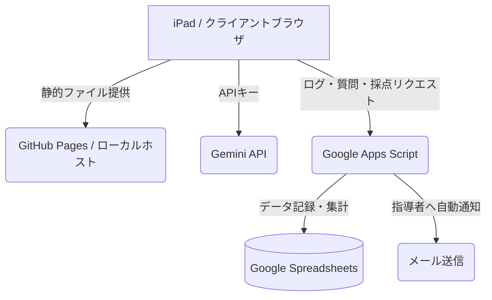

# ⏱️ kano_watching - 自習管理＆対話型数学診断システム（プロトタイプ / WIP）

> ⚠️ **【重要】現在開発中・プロトタイプ公開用のリポジトリです**
> 本プロジェクトは、将来的に個人メディア（note等）での解説記事化を前提として一般公開している開発中のコードです。各種機能の検証・改善中のため、未完成な部分が含まれています。

## 📋 プロジェクト概要

『kano_watching』は、主にiPadを学習端末として用いる生徒（特に高校数学の自習）と、その指導者（家庭教師・メンター）間の対話および学習ログの収集をシームレスに行うための自習支援・対話型実力診断ツールです。

ローカル/エッジ環境（Raspberry Pi等でのセルフホスト）または各種静的ホスティング（GitHub Pages等）での動作を想定し、軽量なHTML/CSS/JavaScriptのみで構築されたフロントエンドと、Google Apps Script (GAS) を介したGoogleスプレッドシートのデータベース連携で動作します。

---

## 🛠️ システム構成・アーキテクチャ

1. **フロントエンド (HTML/CSS/JS)**:
   - レスポンシブでモダンなグラスモーフィズムUI。
   - iPadでの画面分割（Split View）や、バックグラウンド実行（visibility変更時の時間差分キャッチアップ）に対応した絶対時間計測式タイマー。
2. **AI診断 & OCRエンジン (Gemini 3.5 Flash API)**:
   - カメラ撮影された解答用紙のOCR文字起こし、数式補正。
   - 手書きの計算プロセスの論理構造分析、部分点採点、個別弱点診断および市販参考書に対応した復習プラン作成。
3. **データ蓄積・連携層 (Google Apps Script / GAS)**:
   - 学習履歴のリアルタイムスプレッドシート追記。
   - 質問箱機能による指導者への自動メール通知と、双方向回答ロードマップ同期。

---

## ✨ 主な機能（プロトタイプ実装済み）

* **⏱️ バックグラウンド同期対応ポモドーロタイマー**:
  - iPadのスリーブや別タブブラウジング時もタイマーが停止せず、絶対時間差分で自動同期。
  - タイマーの残り時間をぼかして隠す「時計のチラ見防止・全集中機能」。
  - iPadOS/Safari等の音声オートプレイ制限をダミー電子音の再生で突破するWeb Audio APIアラーム。
* **❓ 指指導者直結のデジタル質問箱**:
  - カメラによる問題用紙・ノートの撮影送信（GAS経由のメール通知＆シート記録）。
  - Geminiによるヒント回答即時生成と、指導者からの後日回答データの動的読み込み。
* **🧠 AI採点・実力診断テストシステム**:
  - 手書き文字起こし後のテキスト直接編集（数式プレビュー対応）。
  - Gemini 3.5 Flashを用いた25点満点部分点自動採点、解説生成、および学習ログの自動送信。

---

## 🚀 開発ロードマップ & 予定記事テーマ

今後、以下のような開発と、それに紐づくnote記事（技術ブログ）の執筆を予定しています。

- [ ] GAS連携APIにおけるCORSエラーやリダイレクト制限の完全な回避方法。
- [ ] iPadOSのWebkit環境特有のブラウザバックグラウンド一時停止への絶対時間的対策。
- [ ] Web Audio APIを用いたiOS端末向けサイレント・オートプレイ解除のハック。
- [ ] 個人開発における無料枠限界突破のサーバーレス構成。

---

## 📄 ライセンス

本プロジェクトは [MIT License](LICENSE) のもとで公開されています。商用利用、改変、配布などが自由に行えます。
